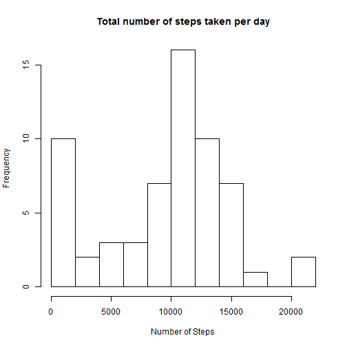
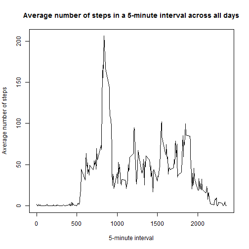
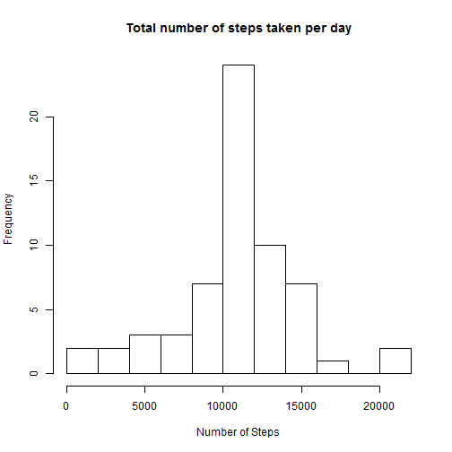
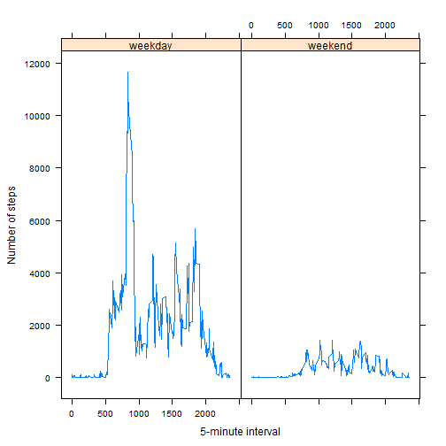

#Programming Assignment 1

##Loading and processing data

Reading, understanding, veryfing and transforming the data.

```r
activity<-read.csv("activity.csv")
head(activity)
```

```
##   steps       date interval
## 1    NA 2012-10-01        0
## 2    NA 2012-10-01        5
## 3    NA 2012-10-01       10
## 4    NA 2012-10-01       15
## 5    NA 2012-10-01       20
## 6    NA 2012-10-01       25
```

```r
str(activity)
```

```
## 'data.frame':	17568 obs. of  3 variables:
##  $ steps   : int  NA NA NA NA NA NA NA NA NA NA ...
##  $ date    : Factor w/ 61 levels "2012-10-01","2012-10-02",..: 1 1 1 1 1 1 1 1 1 1 ...
##  $ interval: int  0 5 10 15 20 25 30 35 40 45 ...
```

```r
#transforming the date in the correct format
activity$date<-as.Date(activity$date,"%Y-%m-%d")
```

##What is mean total number of steps taken per day?

The following histogram shows the distribution of total number of steps taken per day.


```r
stepsbday<-tapply(activity$steps,activity$date,sum,na.rm=TRUE)

hist(stepsbday,breaks=8,main="Total number of steps taken per day",xlab="Number of Steps")
```

 


```r
meanperday<-formatC(mean(stepsbday),digits=6)

medianperday<-median(stepsbday)
```

The mean of total number of steps in a day is 9354.23 and the median is 10395. 
Since this measures are close (considering the range of number of steps) and also analysing the shape of the histogram it is plausible to consider that this data has some symmetry. However, the mass of values closer to zero pulls the average down and disrupts this symmetry.

##What is the average daily activity pattern?

The graphic bellow presents the pattern of daily activity as the average of October and November from the anonymous individual.


```r
stepsb5min<-tapply(activity$steps,activity$interval,mean,na.rm=TRUE)

uniqueinterval<-unique(activity$interval)

plot(uniqueinterval,stepsb5min,type="l",main="Average number of steps in a 5-minute interval across all days",xlab="5-minute interval",ylab="Average number of steps")
```

 

The begging of the x-axis is closer to zero because it is sleep time for the subject, probably.


```r
maxsteps<-0
posmaxsteps<-0

for(i in 1:288){
    if(stepsb5min[i]>maxsteps){
        posmaxsteps<-i
        maxsteps<-stepsb5min[i]
    }
}

max5min<-uniqueinterval[posmaxsteps]
```

The maximum number of steps for his (or her) occurs at 835 5-minute interval in a day (in average).

#Imputing missing values


```r
datastatistics<-summary(activity)
missvalues<-datastatistics[7,1]
```

In the data set activity there are NA's   :2304   missing values.

The missing values are replaced by the mean for the correspondent 5-minute interval defined previously in a new dataset: activity1.


```r
fivemindata<-cbind(stepsb5min,uniqueinterval)

for(i in 1:17568){
    if(is.na(activity$steps[i])==TRUE){
        intervalmiss<-activity$interval[i]
        activity$steps1[i]<-fivemindata[uniqueinterval==intervalmiss,1]
    }
    else {activity$steps1[i]<-activity$steps[i]}
}

#Checking if there isn't NA in the variable steps1
summary(activity)
```

```
##      steps             date               interval          steps1      
##  Min.   :  0.00   Min.   :2012-10-01   Min.   :   0.0   Min.   :  0.00  
##  1st Qu.:  0.00   1st Qu.:2012-10-16   1st Qu.: 588.8   1st Qu.:  0.00  
##  Median :  0.00   Median :2012-10-31   Median :1177.5   Median :  0.00  
##  Mean   : 37.38   Mean   :2012-10-31   Mean   :1177.5   Mean   : 37.38  
##  3rd Qu.: 12.00   3rd Qu.:2012-11-15   3rd Qu.:1766.2   3rd Qu.: 27.00  
##  Max.   :806.00   Max.   :2012-11-30   Max.   :2355.0   Max.   :806.00  
##  NA's   :2304
```


```r
activity1<-activity[,2:4]
head(activity1)
```

```
##         date interval    steps1
## 1 2012-10-01        0 1.7169811
## 2 2012-10-01        5 0.3396226
## 3 2012-10-01       10 0.1320755
## 4 2012-10-01       15 0.1509434
## 5 2012-10-01       20 0.0754717
## 6 2012-10-01       25 2.0943396
```

```r
summary(activity1)
```

```
##       date               interval          steps1      
##  Min.   :2012-10-01   Min.   :   0.0   Min.   :  0.00  
##  1st Qu.:2012-10-16   1st Qu.: 588.8   1st Qu.:  0.00  
##  Median :2012-10-31   Median :1177.5   Median :  0.00  
##  Mean   :2012-10-31   Mean   :1177.5   Mean   : 37.38  
##  3rd Qu.:2012-11-15   3rd Qu.:1766.2   3rd Qu.: 27.00  
##  Max.   :2012-11-30   Max.   :2355.0   Max.   :806.00
```

To understand the effect of filling in the missing values, we reproduce the histogram and the measures of the beginning.


```r
stepsbday1<-tapply(activity1$steps1,activity1$date,sum)

hist(stepsbday1,breaks=8,main="Total number of steps taken per day",xlab="Number of Steps")
```

 

By the histogram it is possible to see that the distribution of total number of steps taken per day is closer to symmetry.


```r
meanperday1<-formatC(mean(stepsbday1),digits=7)

medianperday1<-formatC(median(stepsbday1),digits=7)
```

The mean of total number of steps in a day is 10766.19 and the median is 10766.19. 

The values of mean and median differs from the first part of the assignment, since they are equal now. 

As well as the histogram shows, imputing values on missing data affects the total daily number of steps because we add steps in the subject day that didn't exist before. Then, when calculating the total number of steps in a day it will be higher.

#Are there differences in activity patterns between weekdays and weekends?

First, we identify weekdays in the dataset:

```r
activity1$dayofweek<-weekdays(activity1$date)

activity1$typeday<-"weekday"

activity1$typeday[activity1$dayofweek=="Sábado" | activity1$dayofweek=="domingo"]<-"weekend"
```

Then, we take the average number of steps in each 5-minute interval by weekday/weekend and plot the results.


```r
library(dplyr)
timeday<-group_by(activity1,interval,typeday)
summary_5min<-summarize(timeday,mean5min=sum(steps1))

library(lattice)
xyplot(mean5min~interval | typeday,data=summary_5min, type="l",xlab="5-minute interval",ylab="Number of steps")
```

 

Then, there are differences in activity patterns between weekdays and weekends. During the weekend the average of steps are significantly smaller for the entire day.
